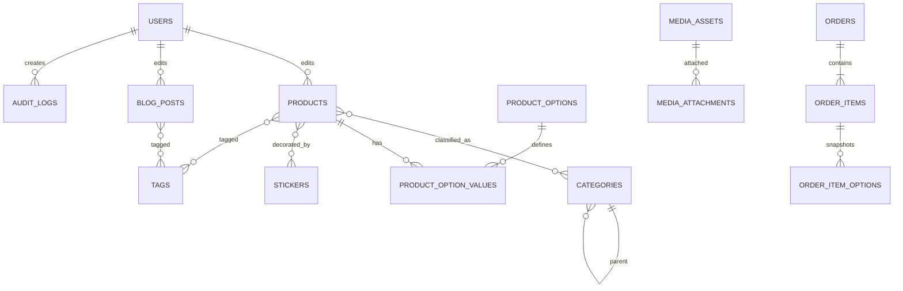

# Scout Report: THUC Coffee Admin Database Gap Audit

## Summary

Phase 3 hiện tại **chưa đủ để triển khai admin/CMS tương đương THUC Coffee**. Bản committed ban đầu có 7 bảng. Trong lúc audit, workspace xuất hiện một draft 12 bảng chưa commit; draft này đã nhận ra options, stickers, settings và static pages nhưng cardinality/phạm vi vẫn lệch admin thật. Tài khoản audit nhìn thấy 20 route quản trị, generic content lifecycle, media quan hệ, product options, stickers, singleton pages, localized static text, site settings và order workflow.

Kết luận chính:

- Không nên triển khai nguyên Phase 3 hiện tại rồi mới vá tiếp; cần sửa schema plan trước migration đầu tiên.
- 7 bảng lõi vẫn dùng được. Draft 12 bảng mới chỉ bổ sung một phần và vẫn thiếu/thiết kế sai ít nhất 10 nhóm persistence nếu mục tiêu là admin parity.
- Admin trả về **43 products, 267 blogs và 125 media records**; seed hiện tại chỉ có 42 products và 10 blogs. Chênh lệch không chỉ do thiếu cột mà còn thiếu dữ liệu nguồn.
- Legacy admin dùng một model `ItemMaster` rất rộng. Không nên copy nguyên bảng generic này; nên chuẩn hóa thành domain tables + shared media/lifecycle.
- Không quan sát thấy màn hình quản lý user/role. Tài khoản hiện tại có thể không phải superadmin, vì vậy RBAC vẫn là phần chưa xác minh.

## Audit Scope And Safety

### Đã thực hiện

- Đăng nhập production admin bằng credential truyền qua file cục bộ.
- Đọc toàn bộ 20 route xuất hiện trong admin navigation.
- Gọi các action chỉ đọc:
  - `load-init`
  - `query`
  - `get-order`
- Đọc Angular bindings, template form, bundle service và response schema.
- Chỉ xuất field names, type names, aggregate counts và relationship counts.

### Không thực hiện

- Không gọi `save-*`, `add-or-update`, `remove`, `delete-*`, `upload-*`, `update-status`, `test-smtp`.
- Không bấm Save, Delete, Publish, Upload hoặc đổi trạng thái.
- Không xuất SMTP password, session cookie, customer information hoặc giá trị record riêng lẻ.
- Không ghi credential vào repository hay báo cáo.

### Giới hạn

- Website chạy ổn qua HTTP legacy; HTTPS có certificate common-name lỗi.
- Chromium automation chặn HTTP legacy, nên audit dùng authenticated HTTP session và đọc server-rendered templates/API contract.
- Role hiện tại không hiển thị user/role management.
- Query Orders giai đoạn `01-01-2020` đến ngày audit trả 0 record; order schema được suy ra từ route, template và status lookup.

## Existing Phase 3 Baseline

Nguồn so sánh:

- `plans/260720-1730-backend-foundation/phase-03-drizzle-schema.md`
- `docs/database-design.md`
- `docs/backend-architecture.md`
- `src/data/*`

### Committed baseline: 7 bảng

Phase 3 ban đầu dự kiến:

| Table | Mục tiêu hiện tại | Kết luận sau admin audit |
|---|---|---|
| `categories` | Key, label, sort order | Thiếu parent, image, summary, locale, lifecycle, audit |
| `products` | Name, slug, price, image, description, published | Thiếu primary category, old price, featured, inventory flags, options, stickers, tags, media, lifecycle, audit |
| `product_categories` | M:N product-category | Có thể giữ, nhưng admin thật còn có `primary_category_id` đơn |
| `blog_posts` | Title, slug, cover, summary, content, publish date | Thiếu category, tags, featured, media placements, soft delete, audit, locale |
| `stores` | Name, slug, address, phone, hours, image, gallery array | Gallery không nên là `text[]`; thiếu Google Map, media metadata, audit |
| `banners` | Image, alt, link, order, active | Một bảng quá đơn giản; admin có 3 banner types, schedule, new-tab, button, content flags và placement |
| `users` | Email, hash, text role | Không đủ auth lifecycle/RBAC; admin hiện tại không cho bằng chứng role management |


### Concurrent worktree draft: 12 bảng

Trong lúc audit, 4 file plan/docs được thay đổi song song. Báo cáo không sửa hoặc ghi đè các file đó. Draft mới vẫn có các lỗi quan trọng:

| Draft addition/change | Draft assumption | Live-admin evidence | Verdict |
|---|---|---|---|
| Product options | Mỗi product sở hữu option groups riêng | Admin có catalog 6 options; mỗi product nhận option links có price/quantity/selected | Sai hướng quan hệ; cần catalog + product-option join có attributes |
| `products.sticker_id` | Tối đa 1 sticker/product | 10 products có 2 stickers; 15 có 1 | Sai cardinality; cần `product_stickers` M:N |
| `site_settings(key,value)` | Gộp settings và Website Text | Settings có boolean/integer/SMTP; Website Text là locale/namespace/key | Cần typed singleton + `localized_texts` riêng |
| `static_pages` chỉ 2 trang | About/Policy/StoresIntro giữ code | Admin chỉnh 6 singleton types và media | Thiếu 4 modules + media relation |
| `banners.type` | Chỉ cần phân loại | Main Banner có CTA/new-tab/content/schedule; promotion có placements | Thiếu fields, placement, schedule, media |
| `stores.gallery text[]` | Gallery chỉ là filenames | 41 Store media rows có priority/name/link/type | Sai mô hình; cần media tables |
| Không soft delete/audit | Chưa có nhu cầu | Model có deleted flag và actor/date; setting có `PermanantDelete` | Thiếu lifecycle capability |
| Không Orders | Clone không bán hàng | Admin route, checkout texts, online-order flag và 4 statuses tồn tại; hiện 0 records | Có thể P1, nhưng phải ghi rõ deferred behavior |
| Không FAQ/About/Policy DB | Nội dung ít đổi | Các module được chỉnh trực tiếp trong admin | Không đạt admin parity |
| 12 tables | Được mô tả là thiết kế đầy đủ | Admin parity cần P0 schema khoảng 20 tables | Chưa đầy đủ |
Trạng thái implementation:

- Chưa có `server/src/db/`, Drizzle schema, migrations hoặc DB client.
- `server/package.json` chưa có Drizzle/`pg` dependencies và DB scripts.
- Vì chưa tạo migration, đây là thời điểm ít tốn kém nhất để sửa Phase 3.

## Admin Routes Visible To Audited Account

| # | Route | Module | Persistence implication |
|---:|---|---|---|
| 1 | `/admin/sitesettings` | Global settings, SMTP, social, feature flags | `site_settings`, secret reference, social/settings fields |
| 2 | `/admin/statictext` | Localized UI copy | `localized_texts` hoặc locale JSONB |
| 3 | `/admin/manageitem?type=Product` | Product CRUD | Products + category + options + stickers + tags + media |
| 4 | `/admin/managecategory?type=ProductCategory` | Hierarchical categories | Parent FK, image, summary, priority |
| 5 | `/admin/multiitemsimple?type=ProductOptions` | Option catalog | `product_options` |
| 6 | `/admin/multiitemsimple?type=Sticker` | Sticker catalog | `stickers`, `product_stickers` |
| 7 | `/admin/manageitem?type=Blog` | Blog CRUD | Blog category/tags/media/lifecycle |
| 8 | `/admin/manageitem?type=Stores` | Store CRUD | Store fields + ordered gallery media |
| 9 | `/admin/multiitemsimple?type=Gallery` | Homepage/general gallery | Gallery collection/items or media placement |
| 10 | `/admin/multiitemsimple?type=MainBanner` | Main hero banners | Banner placement, schedule, CTA, display flags |
| 11 | `/admin/manageitem?type=PromotionBanner` | Promotion banner | Banner subtype + placement media |
| 12 | `/admin/manageitem?type=RightBanner` | Right-side banners | Banner subtype + new-tab |
| 13 | `/admin/singleitem?type=AboutUs` | About singleton | `static_pages` + media |
| 14 | `/admin/singleitem?type=DeliveryIntro` | Delivery singleton | `static_pages`, CTA/button label + media |
| 15 | `/admin/singleitem?type=MembershipContent` | Membership singleton | `static_pages` + banner/gallery media |
| 16 | `/admin/manageitem?type=MembershipFaq` | Membership FAQ list | `faqs` |
| 17 | `/admin/singleitem?type=Recruitment` | Recruitment singleton | `static_pages`, visibility + media |
| 18 | `/admin/singleitem?type=Policy` | Policy singleton | `static_pages` + media |
| 19 | `/admin/singleitem?type=StoresIntro` | Stores intro singleton | `static_pages` + media |
| 20 | `/admin/manageorders?type=orders` | Order list/status/detail | Orders, line items, option snapshots, status lookup |

## Evidence: Live Record Counts

`ItemMasterService query`, `Visible=null`, `PageSize=1000`, audit date 2026-07-21:

| Type | Admin rows | Current clone seed | Gap |
|---|---:|---:|---:|
| Product | 43 | 42 | 1 |
| Blog | 267 | 10 | 257 |
| Stores | 7 | 7 | 0 |
| Membership FAQ | 7 | 0 | 7 |
| Promotion Banner | 1 | 0 | 1 |
| Right Banner | 5 | 0 | 5 |
| Product Options | 6 | 0 | 6 |
| Sticker | 2 | 0 | 2 |
| Main Banner | 2 | 0 | 2 |
| Gallery | 8 | 0 | 8 |
| Product Category | 8 | 10 frontend category labels | Different model |
| Item Media | 125 | Embedded filenames/arrays | Different model |

Tất cả rows trả về ở các query trên có `ITM_Visible=true`. Model có `ITM_IsDeleted` và Site Settings có field `PermanantDelete`, cho thấy legacy system có khả năng hỗ trợ soft/permanent delete. Giá trị production và hành vi delete thực tế chưa được kiểm tra vì audit không gọi delete hoặc đọc setting value.

### Media cardinality

| Parent type | Media rows |
|---|---:|
| Blog | 57 |
| Stores | 41 |
| Product | 15 |
| Membership content | 3 |
| Parent type chưa map | 9 |
| **Total** | **125** |

`stores.gallery text[]` trong Phase 3 sẽ làm mất media name, priority, link, media role và audit. Cần bảng media quan hệ.

### Product option and sticker cardinality

- 43/43 products nhận đủ 6 option objects từ admin contract.
- Selected options:
  - 25 products: 0 selected
  - 9 products: 2 selected
  - 7 products: 3 selected
  - 2 products: 4 selected
- Sticker relationships:
  - 18 products: 0 stickers
  - 15 products: 1 sticker
  - 10 products: 2 stickers

Option catalog thực tế:

- `Lạnh`
- `Nóng`
- `Size nhỏ`
- `Size vừa`
- `1 Egg`
- `2 Eggs`

Selected option link có fields `ITL_OptionID_ITM`, `ITL_ParentsID`, `ITL_PriceType`, `ITL_PriceAmount`, `ITL_Quantity`, `ITL_Name`, `ITL_Notes`, `IsSelected`. Đây là quan hệ có attributes, không thể lưu bằng `text[]` hoặc boolean columns trên product.

## Field-Level Findings By Module

### Product

Form fields quan sát được:

| UI field | Legacy model | Recommended DB mapping |
|---|---|---|
| Upload hình ảnh | `ITM_Image`, variants XS/SM | `products.primary_media_id` -> `media_assets` |
| Tên | `ITM_Name` | `products.name` hoặc translation table |
| Thứ tự | `ITM_Priority` | `products.sort_order NOT NULL DEFAULT 0` |
| Danh mục | `ITM_CategoryID_ITM` | `products.primary_category_id` |
| Giá | `ITM_CurrentPrice` | `products.current_price integer CHECK >= 0` |
| Giá ước tính | Clone `priceEstimated` | `products.price_estimated boolean NOT NULL DEFAULT false` |
| Giá cũ | `ITM_OldPrice` | `products.old_price integer CHECK >= 0` |
| Show On Home | `ITM_Featured` | `products.is_featured` |
| Cart Icon | `ITM_ImageXS`, values `glass`/`bag` | `products.cart_icon` enum/text check |
| Tags | `ListTag` | `tags` + `product_tags` |
| Product option | `Options[]` | `product_options` + `product_option_values` |
| Stickers | `Stickers[]` | `stickers` + `product_stickers` |
| Mô tả ngắn | `ITM_Summary` | `products.summary` |
| Chi tiết | `ITM_Details` | `products.content_html` |
| Gallery/media | `ItemMedia` children | `media_assets` + `media_attachments` |


Migration decision: source TypeScript cho phép `price=null`, 10 products có `priceEstimated=true`, trong khi tài liệu cũ ghi 11. Giữ `current_price integer NULL CHECK (current_price IS NULL OR current_price >= 0)` cho đến khi business xác nhận bắt buộc giá; seed phải dùng count thực 10 hoặc sửa source trước.
Lifecycle fields trả về nhưng Phase 3 thiếu:

- `ITM_Visible`
- `ITM_IsDeleted`
- `ITM_IsOutOfStock`
- `ITM_Quantity`
- `ITM_CreatedBy`, `ITM_LastUpdatedBy`
- `ITM_CreatedDate`, `ITM_UpdatedDate`
- `ITM_CultureCode`
- `ITM_UrlKey`


- Giữ `key` ổn định cho business identity; thêm `slug` cho route thay vì dùng hai field lẫn nhau.
- Nếu chuẩn bị đa ngôn ngữ, dùng category translations và unique `(locale, slug)`. Nếu chỉ `vi-VN`, ghi rõ scope và vẫn bỏ hardcode `category-paths.ts` trước khi admin tạo category mới.
Category semantics: admin có một `primary_category_id`; clone data hiện gắn tối đa 3 categories/product. Giữ `product_categories` cho public grouping nhưng thêm `primary_category_id` để map admin chính xác.

### Product Category

Form fields:

- Image upload
- Category name
- Parent category
- Priority
- Summary

Required schema changes:

- `parent_id REFERENCES categories(id) ON DELETE RESTRICT`
- `image_media_id REFERENCES media_assets(id) ON DELETE SET NULL`
- `summary text`
- `sort_order integer NOT NULL DEFAULT 0`
- visibility, soft-delete, audit fields
- cycle prevention for category tree at service layer

Admin has 8 real `ProductCategory` rows. Frontend 10 categories include presentation/navigation concepts and must not be treated as exact DB rows without mapping.

### Blog

Form fields:

- Primary image
- Category
- Title
- Priority
- Tags
- Summary
- Show on home
- Rich content
- Gallery/media

Admin has 267 visible blog rows. Phase 3 seed of 10 posts is not full CMS data.

Recommended additions:

- `category_id`
- `is_featured`
- `sort_order`
- `content_html`
- `created_by`, `updated_by`, timestamps
- `deleted_at`
- tags relation
- media attachments with roles `home`, `details`, `list`

No scheduled publish control was observed. Keep `published_at` because public contract needs it, but do not claim admin supports scheduling without more evidence.

### Stores

Form mapping:

| UI | Legacy field | Recommended column |
|---|---|---|
| Tên cửa hàng | `ITM_Name` | `stores.name` |
| Thứ tự | `ITM_Priority` | `stores.sort_order` |
| Điện thoại | `ITM_Overview` | `stores.phone` |
| Địa chỉ | `ITM_Information` | `stores.address` |
| Google Map | `ITM_Summary` | `stores.map_embed_url` or `map_html` |
| Image | `ITM_Image` | `primary_media_id` |
| Gallery | `ItemMedia` children | `media_attachments` |

Admin form không có hours field. `stores.hours` trong Phase 3 đến từ frontend/static data, không phải admin evidence. Có thể giữ để phục vụ clone, nhưng phải ghi rõ là clone-specific field.

### Media And Gallery

Observed media fields:

- Parent item ID
- Image/file
- Name
- Priority
- Link/YouTube
- Media type/placement
- JSON metadata
- Upload multiple
- Remove
- Recreate thumbnails

Observed placement examples:

- Promotion Banner: Home, Blog
- Blog: Home, Details, List
- Membership Content: Banner

Recommended:

```text
media_assets
  id, storage_key, original_name, mime_type, width, height, byte_size,
  checksum, created_by, created_at, deleted_at

media_attachments
  id, media_id, owner_type, owner_id, role, name, link_url,
  sort_order, is_default, metadata_jsonb, created_at, updated_at
```

If strict database foreign keys are mandatory, replace polymorphic `owner_type/owner_id` with separate attachment tables per domain or introduce a shared `content_items` root table.

### Stickers

Fields:

- Image
- Name
- Priority
- Visible/use flag
- Show in category list
- Show sticker icon in menu list

Tables:

- `stickers`
- `product_stickers(product_id, sticker_id, sort_order)`

### Banners

Admin has three distinct banner types:

| Type | Fields |
|---|---|
| Main Banner | Image, name, priority, link, button label, new tab, show content, start/end time, content |
| Promotion Banner | Image, title, short text, link, summary, visible, content, placement media |
| Right Banner | Same as promotion + new tab |

Current `banners` lacks:

- `type`/`placement`
- `button_label`
- `summary`, `content_html`, `short_text`
- `open_in_new_tab`
- `show_content`
- `starts_at`, `ends_at`
- media placement/variants
- audit + soft delete

Use one normalized `banners` table with a checked `banner_type` enum plus nullable subtype fields, or separate subtype tables if validation must be strict. For this project, one typed table is simpler.

### Singleton Pages And FAQ

Singleton types:

- `about_us`
- `delivery_intro`
- `membership_content`
- `recruitment`
- `policy`
- `stores_intro`

Common fields:

- Type unique
- Title
- Summary
- Rich content
- Primary image
- Visibility
- CTA/button label for Delivery
- Ordered gallery/media
- Audit/lifecycle

Recommended:

```text
static_pages
  id, page_type UNIQUE, title, summary, content_html, button_label,
  primary_media_id, is_visible, created_by, updated_by,
  created_at, updated_at, deleted_at

faqs
  id, faq_group, question, answer_html, sort_order, is_visible,
  created_by, updated_by, created_at, updated_at, deleted_at
```

Membership FAQ has 7 rows.

### Site Settings

Observed field groups:

- Branding: logo, title, slogan, company name, copyright
- Contact: email, address, address description, phone, fax, cellphone
- Social: Facebook, Twitter, Google+, LinkedIn, Pinterest, YouTube, Vimeo, Instagram, Tumblr, Flickr, Yahoo, Skype
- Geo/map: Google Map, GEO placename, region, position
- SEO/analytics: description, Google Analytics
- SMTP: host, port, username, password, SSL
- Notification targets: order complete, subscribe, contact emails
- Feature flags: recruitment, logs, item/site/page counts, permanent delete, online order
- Reset windows: item view, visit and page view reset time
- Date format

Recommendation:

- Add singleton `site_settings` with typed columns for stable fields.
- Add `social_links(platform, url, sort_order, is_visible)` instead of 13 nullable columns if admin will be rebuilt.
- Never store raw SMTP password in normal settings JSON. Use deployment secret/environment variable or encrypted secret reference.
- Store analytics snippet only if admin truly needs editing; render with strict allowlist and privileged access.
- Add `CHECK (id = 1)` or unique singleton key.

### Localized Static Text

Admin exposes locale `vi-VN` with 18 namespaces:

`Nav`, `Global`, `Footer`, `Subscribe`, `PageHome`, `PageMembership`, `PageSearch`, `PageProduct`, `PageBlog`, `PageContact`, `PageStores`, `PageLogin`, `PageChangePassword`, `PageProfile`, `PageForgotPassword`, `PageRegister`, `PageCheckOut`, `Layout`.

Recommended table:

```text
localized_texts
  id, locale, namespace, key, value, updated_by, updated_at
  UNIQUE(locale, namespace, key)
```

Do not create 100+ columns. Key-value rows are appropriate because the admin itself groups dynamic copy keys by namespace.

### Orders

Observed order fields:

- `ODM_ID`
- customer name
- email
- cellphone
- overview/note
- created date
- status ID
- total price

Observed order detail fields:

- item image snapshot
- item name snapshot
- unit price
- quantity
- line total
- selected option name, price amount and quantity

Status lookup values:

- `Received`
- `Processing`
- `Approved`
- `Declined`

Recommended:

```text
orders
  id, customer_name, email, phone, note, status,
  total_quantity, total_amount, created_at, updated_at, deleted_at

order_items
  id, order_id, product_id NULL, product_name_snapshot,
  image_snapshot, unit_price, quantity, line_total

order_item_options
  id, order_item_id, option_name_snapshot, price_amount, quantity
```

Use snapshots even when `product_id` exists, otherwise product edits alter historical orders.

### Users, Roles And Audit

Observed:

- Email/password login with ASP.NET session cookie.
- Content rows expose created/last-updated actor IDs and names.
- No user/role administration route visible to the current account.

Required minimum:

- Add nullable `created_by` and `updated_by` FKs to all editable entities.
- Production import không seed users: bỏ legacy actor IDs, hoặc lưu `source_actor_id/source_actor_name` snapshot; không gắn FK giả.
- Add `deleted_at`, `deleted_by` where soft delete applies.
- Change `users.role text DEFAULT 'admin'`; default-admin is unsafe.
- Minimum default should be `editor`, or require explicit role at user creation.
- Add `audit_logs` if admin parity includes traceability.

RBAC tables remain conditional until a superadmin account/menu is inspected:

- `roles`
- `permissions`
- `user_roles`
- `role_permissions`

## Generic Legacy Model: What Not To Copy

Admin legacy API returns one wide item object containing fields for every content type:

- identity/type/parent/category
- images and variants
- featured/visible/deleted/out-of-stock
- quantity and prices
- link/tag/code
- global/culture JSON
- name, slug, description, overview, information, summary, details
- options, stickers, media, tags, children and links

This design enables generic admin templates but overloads columns: store phone is `Overview`, address is `Information`, Google Map is `Summary`. Copying it 1:1 would make the new backend hard to validate and maintain.
Phase 3 có hai track khác nhau:

- **Track A — static clone/seed:** draft 12 bảng có thể tiếp tục nếu không xây admin parity, nhưng phải sửa option/sticker cardinality trước migration.
- **Track B — admin parity:** cần P0 schema dưới đây.

Yêu cầu hiện tại là học và triển khai DB theo admin THUC, vì vậy báo cáo khuyến nghị Track B. Đây không phải tuyên bố static clone bắt buộc phải có đủ 20 bảng.

Recommended rule: preserve observed behavior, not legacy column names.

## Recommended Revised Schema

### P0: Required for CMS/admin parity

Modify existing:

1. `categories`
2. `products`
3. `product_categories`
4. `blog_posts`
5. `stores`
6. `banners`
7. `users`

Add:

8. `product_options`
9. `product_option_values`
10. `stickers`
11. `product_stickers`
12. `tags`
13. `product_tags`
14. `blog_tags`
15. `media_assets`
16. `media_attachments`
17. `static_pages`
18. `faqs`
19. `site_settings`
20. `localized_texts`

### P1: Full admin behavior

21. `orders`
22. `order_items`
23. `order_item_options`
24. `audit_logs`
25. `slug_redirects`

### P2: Only after access confirms need

26. `roles`
27. `permissions`
28. `user_roles`
29. `role_permissions`
30. Generic custom-field/link tables matching unused `FieldMasterService` and `LinkMasterService`

Do not add P2 custom-field tables merely because the legacy bundle contains reusable code. No THUC route audited showed a concrete business requirement for them.

## Relationship Model



## Constraints And Indexes To Add

### Global lifecycle

- `created_at timestamptz NOT NULL DEFAULT now()`
- `updated_at timestamptz NOT NULL DEFAULT now()`; update explicitly in repository/service layer
- `created_by`, `updated_by` nullable, `REFERENCES users(id) ON DELETE SET NULL`
- Legacy actor metadata không map được phải để null hoặc lưu source snapshot riêng
- `deleted_at timestamptz NULL`
- Partial indexes for active rows: `WHERE deleted_at IS NULL`

### Products

- `current_price IS NULL OR current_price >= 0` cho đến khi chốt non-null contract
- `price_estimated boolean NOT NULL DEFAULT false`
- `old_price IS NULL OR old_price >= 0`
- `quantity >= 0`
- partial unique active slugs riêng cho `products`, `blog_posts`, `stores`
- chốt slug reuse sau soft delete; tạo `slug_redirects` khi slug đã publish thay đổi
- indexes: primary category, visible/featured/sort, deleted state

### Product option relation

- unique `(product_id, option_id)`
- `price_amount >= 0`
- `quantity >= 0`
- FK delete cascade from product; restrict option deletion while assigned, or soft-delete option

### Categories

- parent `ON DELETE RESTRICT`
- prevent self-parent and cycles
- `key` unique và ổn định; `slug` dùng cho route
- unique `(locale, slug)` nếu localization được bật
- category route generation phải đọc DB; không tiếp tục phụ thuộc hoàn toàn vào `category-paths.ts`

### Media

- unique storage key
- optional checksum index for duplicate detection
- attachment unique constraint by `(owner_type, owner_id, role, sort_order)` as appropriate

### Banners

- `ends_at IS NULL OR starts_at IS NULL OR ends_at > starts_at`
- index `(banner_type, is_visible, sort_order)`
- schedule index on start/end when automatic activation is implemented

### Localized text

- unique `(locale, namespace, key)`

### Orders

## Baseline-to-Revised Migration Matrix

| Baseline column | Revised mapping | Transform/default/nullability |
|---|---|---|
| `products.price` | `products.current_price` | Nullable tạm thời; check non-negative |
| `products.price_estimated` | giữ nguyên | Default false; seed theo source count 10 |
| `products.thumb`, `products.image` | `primary_media_id` + derived variants | Backfill media asset; giữ legacy filename trong migration staging |
| `products.description` | `summary` hoặc `content_html` | Chốt mapping theo field source; không copy mù |
| `is_published` | `is_visible` | Default true cho seed; soft-delete độc lập |
| `stores.gallery text[]` | `media_assets` + `media_attachments` | Tạo ordered attachments; không chỉ split filenames |
| `banners` basic fields | typed banner fields + media | Default type/placement theo source component |
| `users.role` | checked role hoặc RBAC | Không default admin; default editor/explicit role |

- amounts and quantities non-negative
- immutable financial snapshots after order submission
- index `(status, created_at DESC)` and normalized email/phone search indexes if required

## Phase 3 Update Recipe

Do not keep concurrent Phase 3 draft as a single “create 12 tables” task when choosing Track B. Replace it with these executable subphases:

### Phase 3A: shared lifecycle and media

- Install Drizzle/pg dependencies.
- Create DB client and migration config.
- Create `users`, `media_assets`, `media_attachments`, `site_settings`, `localized_texts`.
- Define timestamps, soft-delete and audit conventions once.

### Phase 3B: product catalog

- Create/extend categories with hierarchy.
- Create products with primary category and lifecycle fields.
- Keep product-category M:N for public grouping.
- Add product options/value relation.
- Add stickers and tags relations.

### Phase 3C: editorial CMS

- Extend blog posts.
- Extend stores and replace gallery array with media attachments.
- Create banners, static pages and FAQs.
- Seed banner/page/media relations from audited admin data or verified source exports.

### Phase 3D: commerce and audit

- Add orders, order items, option snapshots and status enum.
- Add audit logs.
- Add slug redirects if admin permits slug edits after publish.

### Phase 3E: migration verification

- Verify FK delete policies.
- Verify partial unique indexes for active slugs.
- Verify one site-settings singleton.
- Verify category cycle rejection.
- Verify product option/sticker cardinality.
- Verify media attachment ordering.
- Verify order snapshot immutability.

## Seed And Migration Implications

Current `src/data` must not be treated as full production export:

- Products: 42 local vs 43 admin.
- Blogs: 10 local vs 267 admin.
- Categories: 10 frontend concepts vs 8 admin ProductCategory rows.
- Stores: 7 match.
- Media: local filenames/arrays cannot reconstruct 125 media records with placement and ordering.

Recommended seed sources:

| Data group | Source |
|---|---|
| Products/categories/blog/stores | Authenticated read-only export/API after explicit export implementation |
| Product options/stickers | Admin query contract |
| Media | Asset crawl + parent/role mapping; never infer order from filename |
| Singleton pages/settings/static text | Dedicated read-only export with secret fields excluded |
| Users/SMTP secret/orders | Do not seed from production |

## Admin UX Observations Affecting New Implementation

These do not change the DB verdict but affect admin rebuild acceptance:

- Filters and pagination are encoded in URL/hash; preserve deep-linkable list state.
- Delete uses native confirmation and a generic remove service. New admin should use explicit confirmation and preferably undo/restore for soft deletes.
- Legacy lists are Angular/div driven rather than semantic tables. New admin should use accessible table/list structure.
- Rich text and upload controls need visible validation, file type/size rules and unsaved-change warnings.
- Long lists such as 267 blogs require server pagination and indexed filters.

## Recommendations

1. Chọn Track A hoặc B trước migration. Với mục tiêu admin parity hiện tại, rewrite draft 12 bảng around P0 schema above.
2. Keep domain-specific names; do not copy `ITM_Overview`, `ITM_Information`, `ITM_Summary` overloads.
3. Replace `stores.gallery text[]` with media tables.
4. Add product options, stickers, tags and their join tables before product CRUD implementation.
5. Add category hierarchy and primary category semantics.
6. Split banners by `banner_type`/placement and add schedule/CTA flags.
7. Add singleton pages, FAQs, site settings and localized text.
8. Add lifecycle/audit columns consistently; fix unsafe default-admin role.
9. Treat Orders as P1 unless online ordering is explicitly out of scope.
10. Build a sanitized production export path before claiming seed parity; HTML crawl data is insufficient for 267 blogs and 125 media relationships.

## Unresolved Questions

1. Tài khoản hiện tại là superadmin hay restricted admin? User/role pages có bị ẩn không?
2. Có cần clone toàn bộ 267 blog records hay chỉ public-visible subset theo sitemap/business scope?
3. Product thứ 43 là nội dung mới, route ẩn hay clone hiện đang thiếu?
4. `product_categories` M:N là business requirement mới hay chỉ cách clone frontend gom nhóm? Admin thật dùng một primary category.
5. Rich content được lưu raw HTML; sanitation policy và allowed tags chưa xác minh.
6. `PermanantDelete` production hiện bật hay tắt? Giá trị không được xuất vì audit không đọc setting values.
7. 9 media records có parent type nào ngoài các module đã map?
8. Order online có đang tắt không? Query giai đoạn 2020 đến ngày audit trả 0 orders.
9. Có cần multilingual beyond `vi-VN` ngay Phase 3 hay chỉ thiết kế schema-ready?
10. SMTP password sẽ chuyển sang deployment secret nào trong Dokploy?
